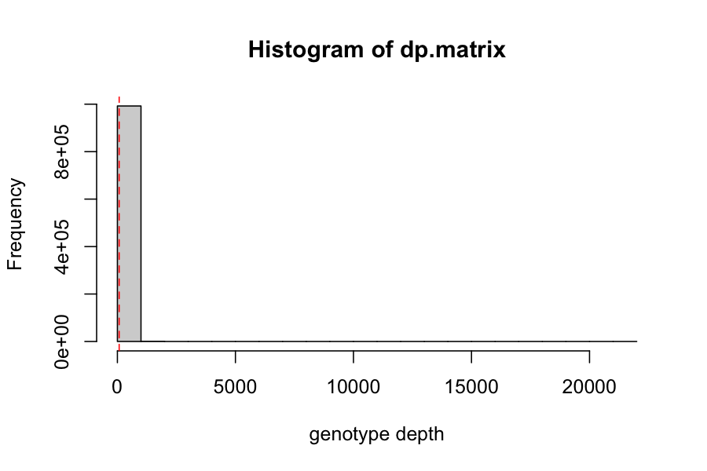
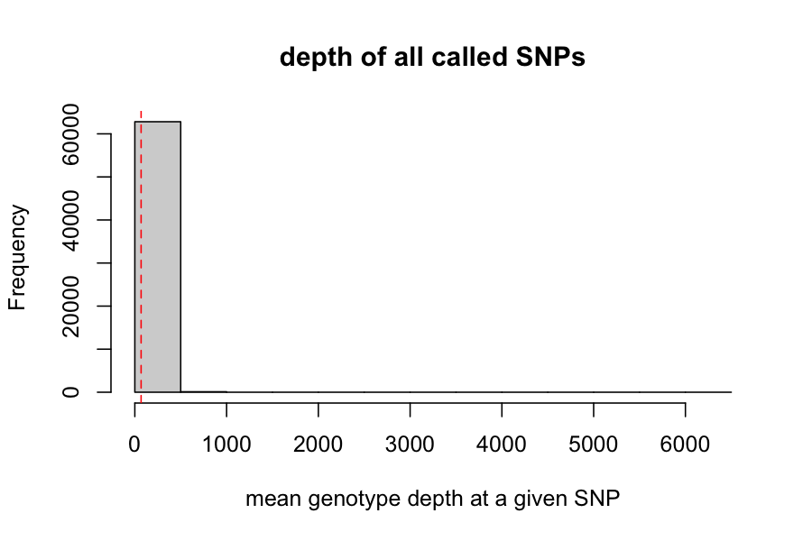
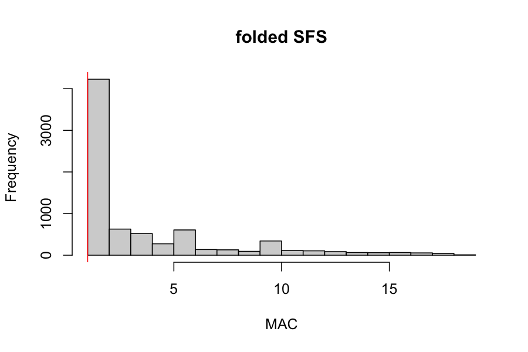
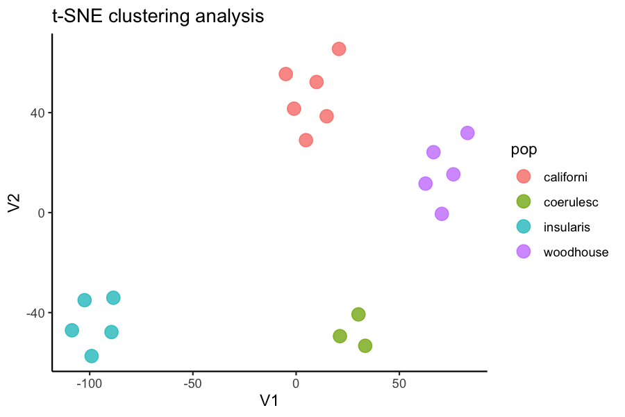
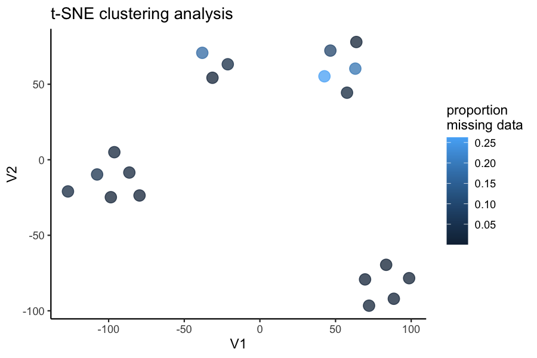

<!-- README.md is generated from README.Rmd. Please edit that file -->

# SNPfiltR 

<!-- badges: start -->


[](https://zenodo.org/badge/latestdoi/397722868)

<!-- badges: end -->

SNPfiltR is an R package to streamline and automate the process of
choosing appropriate filtering parameters for next-gen SNP datasets. The
package was designed with RADseq (Restriction-site Associated DNA
sequencing) data in mind, but can be used on any SNP dataset in need of
data exploration and quality filtering (e.g., whole genome resequencing,
UCEs, sequence capture, GBS). SNPfiltR shines when used on moderate
sized reduced-representation genomic datasets, where an array of quality
and completeness parameters can be rapidly explored in a single,
interactive Rstudio session. SNPfiltR is available from both
[CRAN](https://cran.r-project.org/web/packages/SNPfiltR/index.html) and
[GitHub](https://github.com/DevonDeRaad/SNPfiltR).

## Installation

``` r
#Install current release from CRAN
install.packages("SNPfiltR")

#Install current development version directly from GitHub
library(devtools)
install_github("DevonDeRaad/SNPfiltR")
```

## Citation

If you are using SNPfiltR to investigate and filter your SNP dataset, I
recommend citing both SNPfiltR and the R package vcfR (which is used to
read in vcf files as ‘vcfR’ objects, and heavily used inside of SNPfiltR
functions) e.g., “We used the R packages *SNPfiltR* (DeRaad, 2021) and
*vcfR* (Knaus and Grunwald, 2017) to iteratively filter our SNP dataset
based on various quality and completeness metrics.”

DeRaad, D.A. 2021. SNPfiltR: an R package for interactive and
reproducible SNP filtering. Preprint on Authorea.
<http://dx.doi.org/10.22541/au.163976415.53888836/v1>

Knaus, Brian J., and Niklaus J. Grunwald. 2017. VCFR: a package to
manipulate and visualize variant call format data in R. Molecular
Ecology Resources 17(1):44-53.
<http://dx.doi.org/10.1111/1755-0998.12549>.

## Full documentation

To see vignettes using SNPfiltR to execute an interactive SNP filtering
pipeline for real empirical [UCE
data](https://devonderaad.github.io/SNPfiltR/articles/scrub-jay-UCE-vignette.html)
and [RADseq
data](https://devonderaad.github.io/SNPfiltR/articles/scrub-jay-RADseq-vignette.html),
please check out the [pkgdown
site](https://devonderaad.github.io/SNPfiltR/). Or, for a quick start,
simply follow the example pipeline executed below:

### Optional Step 0:

Do quality control per sample before performing SNP calling. I have
written an [RMarkdown
script](https://github.com/DevonDeRaad/SNPfiltR/blob/master/inst/extdata/fastqcr.Rmd)
which is distributed with this package, and uses the R package
[fastqcr](https://github.com/kassambara/fastqcr) to generate a report
visualizing the quality and quantity of sequencing for each sample, and
recommending a subset of samples to be immediately dropped before
parameter optimization (specifically useful for RADseq data). The only
modification necessary for this script is the path to the folder
containing the input .fastq.gz files and the path to your desired output
folder. An example report generated using this script can be seen
[here](https://devonderaad.github.io/RADstackshelpR/articles/quality.control.vignette.html).
Because the fastq.gz files for your experiment may be large and handled
remotely, an example bash script for executing this RMarkdown file as a
job on a high performance computing cluster is also included
[here](https://github.com/DevonDeRaad/SNPfiltR/blob/master/inst/extdata/RMarkdown.qc.submit.script.sh).

#### Because this dataset was not overly large, and I used a reference based assembly that doesn’t depend on each sample contributing to the de novo building of RAD loci, I chose to skip this step and do all of the per sample quality filtering in R. I started below by reading in the vcf file using the aforementioned vcfR package. This example uses a subset proportion of a real vcf file in order to control runtimes. The full analysis of this dataset can be viewed [here](https://devonderaad.github.io/SNPfiltR/articles/scrub-jay-RADseq-vignette.html)

### Step 1:

#### Read in vcf file using [vcfR](https://knausb.github.io/vcfR_documentation/)

``` r
library(SNPfiltR)
#> This is SNPfiltR v.0.1.1
#> 
#> Detailed usage information is available at: devonderaad.github.io/SNPfiltR/ 
#> 
#> If you use SNPfiltR in your published work, please cite the following papers: 
#> 
#> DeRaad, D.A. 2021. SNPfiltR: an R package for interactive and reproducible SNP filtering. Preprint on Authorea. <http://dx.doi.org/10.22541/au.163976415.53888836/v1> 
#> 
#> Knaus, Brian J., and Niklaus J. Grunwald. 2017. VCFR: a package to manipulate and visualize variant call format data in R. Molecular Ecology Resources 17.1:44-53. http://dx.doi.org/10.1111/1755-0998.12549.
library(vcfR)
#> 
#>    *****       ***   vcfR   ***       *****
#>    This is vcfR 1.12.0 
#>      browseVignettes('vcfR') # Documentation
#>      citation('vcfR') # Citation
#>    *****       *****      *****       *****
```

``` r
#read in vcf as vcfR
vcfR <- read.vcfR("~/Downloads/subset.scrub.vcf")
```

``` r
### check the metadata present in your vcf
vcfR
#> ***** Object of Class vcfR *****
#> 20 samples
#> 71 CHROMs
#> 75,873 variants
#> Object size: 95.7 Mb
#> 34.55 percent missing data
#> *****        *****         *****

#generate popmap file. Two column popmap with the same format as stacks, and the columns must be named 'id' and 'pop'
popmap<-data.frame(id=colnames(vcfR@gt)[2:length(colnames(vcfR@gt))],pop=substr(colnames(vcfR@gt)[2:length(colnames(vcfR@gt))], 3,11))
```

### Step 2:

#### Implement quality filters that don’t involve missing data. This is because removing low data samples will alter percentage/quantile based missing data cutoffs, so we wait to implement those until after deciding on our final set of samples for downstream analysis

#### Note:

I like to start with a completely unfiltered vcf file, in order to
implement a cohesive, fully documentable filtering pipeline in R.
However, if I have a very large unfiltered vcf file that I would like to
work with in Rstudio, I sometimes perform hard filtering, or implement
some conservative percentage based filters (e.g., remove all SNPs above
90% missing data) via command-line calls to the program VCFtools, in
order to reduce the size of the starting vcf that I need to read into
Rstudio. Just be aware that once you drop low data samples, your
previously enforced (per SNP or locus) missing data % will no longer be
accurate. VCFtools has faster implementations of some of the same
filters implemented here, and really shines with large datasets. The
R-based implementations of these filters in SNPfiltR offers interactive
visualization in a cohesive R-based pipeline, but be aware that reading
in excessively large files to Rstudio (typically, \> 1 Gb in my
experience) can cause R to hang and crash. Luckily, I have found that
variant sites only vcf files for most reduced-representation genomic
datasets are under this size, and can be handled efficiently using
Rstudio on a personal computer.

#### Note:

Jon Puritz has an excellent filtering tutorial that is focused
specifically on [filtering RADseq
data](https://www.ddocent.com/filtering/) Multiple functions in SNPfiltR
were generated in order to follow the guidelines and suggestions laid
out in this tutorial. We can follow these guidelines for hard filtering
(he suggests minimum depth=3, gq =30), and can implement suggested
filters like allele balance and max depth, here in R using SNPfiltR.

#### start by visualizing the distributions of depth of sequencing and genotype quality among called genotypes, then set appropriate cutoffs for both values for this dataset.

``` r
#visualize distributions
hard_filter(vcfR=vcfR)
#> no depth cutoff provided, exploratory visualization will be generated.
```



    #> no genotype quality cutoff provided, exploratory visualization will be generated.


    #> ***** Object of Class vcfR *****
    #> 20 samples
    #> 71 CHROMs
    #> 75,873 variants
    #> Object size: 95.7 Mb
    #> 34.55 percent missing data
    #> *****        *****         *****

    #hard filter to minimum depth of 5, and minimum genotype quality of 30
    vcfR<-hard_filter(vcfR=vcfR, depth = 5, gq = 30)
    #> 27.3% of genotypes fall below a read depth of 5 and were converted to NA
    #> 3.5% of genotypes fall below a genotype quality of 30 and were converted to NA

#### Then use this function to filter for allele balance

From the [Ddocent SNP filtering
tutorial](https://www.ddocent.com/filtering/) “Allele balance: a number
between 0 and 1 representing the ratio of reads showing the reference
allele to all reads, considering only reads from individuals called as
heterozygous, we expect that the allele balance in our data (for real
loci) should be close to 0.5”

#### the SNPfiltR allele balance function will convert heterozygous genotypes to missing if they fall outside of the .25-.75 range.

``` r
#execute allele balance filter
vcfR<-filter_allele_balance(vcfR)
#> 7.66% of het genotypes (0.66% of all genotypes) fall outside of 0.25 - 0.75 allele balance ratio and were converted to NA
```


Now we can execute a max depth filter (super high depth loci are likely
multiple loci stuck together into a single paralogous locus).

#### Note:

This filter is applied ‘per SNP’ rather than ‘per genotype’ otherwise we
would simply be removing most of the genotypes from our deepest
sequenced samples (because sequencing depth is so variable between
samples). By filtering per SNP, we remove the SNPs with outlier depth
values, which are most likely to be spuriously mapped/built paralagous
loci.

``` r
#visualize and pick appropriate max depth cutoff
max_depth(vcfR)
#> cutoff is not specified, exploratory visualization will be generated.
```



    #> dashed line indicates a mean depth across all SNPs of 68.3


``` r
#filter vcf by the max depth cutoff you chose
vcfR<-max_depth(vcfR, maxdepth = 100)
#> maxdepth cutoff is specified, filtered vcfR object will be returned
#> 19.33% of SNPs were above a mean depth of 100 and were removed from the vcf
```


#### Note:

It may be a good idea to additionally filter out SNPs that are
significantly out of HWE if you have a really good idea of what the
population structure in your sample looks like and good sample sizes in
each pop. For this dataset, which is highly structured (many isolated
island pops) with species boundaries that are in flux, I am not going to
use a HWE filter, because I don’t feel comfortable confidently
identifying populations in which we can expect HWE. Many other programs
(such as VCFtools) can filter according to HWE if desired.

``` r
#check vcfR to see how many SNPs we have left
vcfR
#> ***** Object of Class vcfR *****
#> 20 samples
#> 62 CHROMs
#> 61,203 variants
#> Object size: 52.4 Mb
#> 65.45 percent missing data
#> *****        *****         *****
```

### Step 3:

#### Set arbitrary cutoff for missing data allowed per sample.

Determining which samples and SNPs to retain is always project specific,
and is contingent on sampling, biology of the focal taxa, sequencing
idiosyncrasies, etc. SNPfiltR contains functions designed to simply and
easily generate exploratory visualizations that will allow you to make
informed decisions about which samples and SNPs are of sufficient
quality to retain for downstream analyses, but there is never a single
correct option for these cutoffs. In my experience, the best thing to do
is to look at your data, look at what effects some reasonable cutoffs
would have on your data, and pick one that works for you. Then as you
continue to analyze your data, make sure that your arbitrary filtering
decisions are not driving the patterns you see, and iteratively update
your filtering approach if you are concerned about the effects previous
filtering choices are having on downstream results.

#### We will start by determining which samples contain too few sequences to be used in downstream analyses, by visualizing missing data per sample

``` r
#run function to visualize samples
missing_by_sample(vcfR=vcfR, popmap = popmap)
#> Bin width defaults to 1/30 of the range of the data. Pick better value with `binwidth`.
#> Bin width defaults to 1/30 of the range of the data. Pick better value with `binwidth`.
```


#### Now we can try setting a reasonable threshold, and then visualizing
clustering patterns to determine whether there are still problematic
samples with excess missing data that can’t be accurately assigned to
genetic clusters

``` r
#run function to drop samples above the threshold we want from the vcf
vcfR<-missing_by_sample(vcfR=vcfR, cutoff = .9)
#> 1 samples are above a 0.9 missing data cutoff, and were removed from VCF
```


``` r
#subset popmap to only include retained individuals
popmap<-popmap[popmap$id %in% colnames(vcfR@gt),]

#remove invariant sites generated by dropping individuals
vcfR<-min_mac(vcfR, min.mac = 1)
#> 50.23% of SNPs fell below a minor allele count of 1 and were removed from the VCF
```


``` r
#verify that missing data is not driving clustering patterns among the retained samples
miss<-assess_missing_data_pca(vcfR=vcfR, popmap = popmap, thresholds = .8, clustering = FALSE)
#> cutoff is specified, filtered vcfR object will be returned
#> 69.26% of SNPs fell below a completeness cutoff of 0.8 and were removed from the VCF
#> Loading required namespace: adegenet
```


``` r
#if there are still problematic samples, drop them using the following syntax
#vcfR <- vcfR[,colnames(vcfR@gt) != "A_woodhouseii_24711" & colnames(vcfR@gt) != "A_californica_45901"]
```

### Step 4:

#### Set arbitrary cutoff for missing data allowed per SNP.

#### We can visualize the effect that typical missing data cutoffs will have on both the number of SNPs retained and the total missing data in our entire dataset.We want to choose a cutoff that minimizes the overall missing data in the dataset, while maximizing the total number of loci retained.

#### Note:

This filter interacts with the above filter, where we dropped low data
samples. A good rule of thumb is that individual samples shouldn’t be
above 50% missing data after applying a per-SNP missing data cutoff. So
if we are retaining specific low data samples out of necessity or
project design, we may have to set a more stringent per-SNP missing data
cutoff, at the expense of the total number of SNPs retained for
downstream analyses. We can again use the assess_missing_data_pca()
function to determine whether all retained samples contain enough data
at our chosen cutoff in order to be assigned accurately to their species
group.

``` r
#visualize missing data by SNP and the effect of various cutoffs on the missingness of each sample
missing_by_snp(vcfR)
#> cutoff is not specified, exploratory visualizations will be generated
#> Picking joint bandwidth of 0.128
```


    #>    filt missingness snps.retained
    #> 1  0.30  0.28966424         23891
    #> 2  0.50  0.20181035         18653
    #> 3  0.60  0.15670806         15745
    #> 4  0.65  0.13397028         14218
    #> 5  0.70  0.11164312         12663
    #> 6  0.75  0.08957320         11053
    #> 7  0.80  0.06774145          9363
    #> 8  0.85  0.04616671          7555
    #> 9  0.90  0.02381958          5482
    #> 10 0.95  0.00000000          3001
    #> 11 1.00  0.00000000          3001

    #verify that missing data is not driving clustering patterns among the retained samples at some reasonable thresholds
    miss<-assess_missing_data_pca(vcfR=vcfR, popmap = popmap, thresholds = c(.7,.8,.85), clustering = FALSE)
    #> cutoff is specified, filtered vcfR object will be returned
    #> 58.43% of SNPs fell below a completeness cutoff of 0.7 and were removed from the VCF


    #> cutoff is specified, filtered vcfR object will be returned


    #> 69.26% of SNPs fell below a completeness cutoff of 0.8 and were removed from the VCF


    #> cutoff is specified, filtered vcfR object will be returned


    #> 75.2% of SNPs fell below a completeness cutoff of 0.85 and were removed from the VCF


``` r
#choose a value that retains an acceptable amount of missing data in each sample, and maximizes SNPs retained while minimizing overall missing data, and filter vcf
vcfR<-missing_by_snp(vcfR, cutoff = .85)
#> cutoff is specified, filtered vcfR object will be returned
#> 75.2% of SNPs fell below a completeness cutoff of 0.85 and were removed from the VCF
```


``` r
#check how many SNPs and samples are left
vcfR
#> ***** Object of Class vcfR *****
#> 19 samples
#> 34 CHROMs
#> 7,555 variants
#> Object size: 14.3 Mb
#> 4.617 percent missing data
#> *****        *****         *****
```

### Step 5:

#### investigate the effect of a minor allele count (MAC) cutoff on downstream inferences.

#### MAC/MAF cutoffs can be helpful in removing spurious and uninformative loci from the dataset, but also have the potential to bias downstream inferences. Linck and Battey (2019) have an excellent paper on just this topic. From the paper-

“We recommend researchers using model‐based programs to describe
population structure observe the following best practices: (a) duplicate
analyses with nonparametric methods suchas PCA and DAPC with cross
validation (b) exclude singletons (c) compare alignments with multiple
assembly parameters When seeking to exclude only singletons in
alignments with missing data (a ubiquitous problem for
reduced‐representation library preparation methods), it is preferable to
filter by the count (rather than frequency) of the minor allele, because
variation in the amount of missing data across an alignment will cause a
static frequency cutoff to remove different SFS classes at different
sites””

#### Our package contains a convenient wrapper functions that can filter based on minor allele count (MAC) and streamline investigation of the effects of various filtering parameters on sample clustering patterns.

``` r
#investigate clustering patterns with and without a minor allele cutoff
#use min.mac() to investigate the effect of multiple cutoffs
vcfR.mac<-min_mac(vcfR = vcfR, min.mac = 2)
#> 39.21% of SNPs fell below a minor allele count of 2 and were removed from the VCF
```



``` r
#assess clustering without MAC cutoff
miss<-assess_missing_data_tsne(vcfR, popmap, clustering = FALSE)
```



``` r
#assess clustering with MAC cutoff
miss<-assess_missing_data_tsne(vcfR.mac, popmap, clustering = FALSE)
```



``` r

#based on these visualizations, singletons are not obviously biasing clustering patterns, so I will leave them in for now. If I want to run a program like STRUCTURE, where singletons are known to bias inference, I can write out the vcf with singletons removed as well:
#vcfR::write.vcf(vcfR.mac, file = "~/Downloads/scrub.jay.mac.vcf.gz")
```

#### Finally, we will make sure that the depth and genotype quality look consistent across SNPs and samples, following our filtering pipeline.

``` r
#plot depth per snp and per sample
dp <- extract.gt(vcfR, element = "DP", as.numeric=TRUE)
heatmap.bp(dp, rlabels = FALSE)
```


``` r
#plot genotype quality per snp and per sample
gq <- extract.gt(vcfR, element = "GQ", as.numeric=TRUE)
heatmap.bp(gq, rlabels = FALSE)
```


### Step 6:

#### Write out vcf files for downstream analyses.

#### Optionally, we can use the distance_thin() function from the SNPfiltR package in order to filter our SNPs to a minimum distance between SNPs, in order to get a set of unlinked SNPs for downsteam analyses

#### Note:

The function vcfR::write.vcf() automatically writes a gzipped vcf file,
so be sure to add the suffix .gz to the name of your output file.

#### Write out the filtered vcf, and a linkage filtered version, for downstream analyses

``` r
#write out vcf with all SNPs
vcfR::write.vcf(vcfR, "~/Downloads/aphelocoma.filtered.vcf.gz")

#linkage filter vcf to thin SNPs to one per 500bp
vcfR.thin<-distance_thin(vcfR, min.distance = 500)
#>   |                                                                              |                                                                      |   0%  |                                                                              |==                                                                    |   3%  |                                                                              |====                                                                  |   6%  |                                                                              |======                                                                |   9%  |                                                                              |========                                                              |  12%  |                                                                              |==========                                                            |  15%  |                                                                              |============                                                          |  18%  |                                                                              |==============                                                        |  21%  |                                                                              |================                                                      |  24%  |                                                                              |===================                                                   |  26%  |                                                                              |=====================                                                 |  29%  |                                                                              |=======================                                               |  32%  |                                                                              |=========================                                             |  35%  |                                                                              |===========================                                           |  38%  |                                                                              |=============================                                         |  41%  |                                                                              |===============================                                       |  44%  |                                                                              |=================================                                     |  47%  |                                                                              |===================================                                   |  50%  |                                                                              |=====================================                                 |  53%  |                                                                              |=======================================                               |  56%  |                                                                              |=========================================                             |  59%  |                                                                              |===========================================                           |  62%  |                                                                              |=============================================                         |  65%  |                                                                              |===============================================                       |  68%  |                                                                              |=================================================                     |  71%  |                                                                              |===================================================                   |  74%  |                                                                              |======================================================                |  76%  |                                                                              |========================================================              |  79%  |                                                                              |==========================================================            |  82%  |                                                                              |============================================================          |  85%  |                                                                              |==============================================================        |  88%  |                                                                              |================================================================      |  91%  |                                                                              |==================================================================    |  94%  |                                                                              |====================================================================  |  97%  |                                                                              |======================================================================| 100%
#> 2550 out of 7555 input SNPs were not located within 500 base-pairs of another SNP and were retained despite filtering

#write out thinned vcf
#vcfR::write.vcf(vcfR.thin, "~/Downloads/aphelocoma.filtered.thinned.vcf.gz")
```
